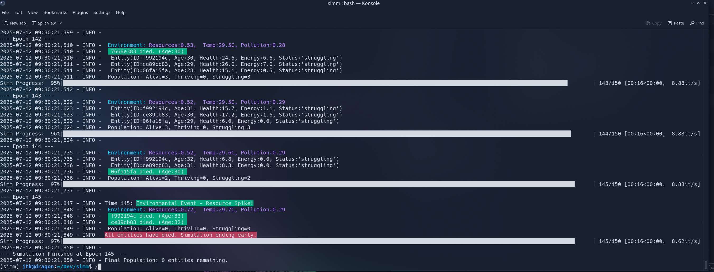

# TerminalLifeform

**TerminalLifeform** is a terminal-native simulation about survival, entropy, and watching little digital lifeforms succeed (or fail).

**Entities live and die.**  
**Sometimes they thrive.**  
**Usually, they perish.**



---

## 🧬 Features

🔁 Terminal UI (with color, progress bars, status indicators)
🧬 Object-oriented and modular design
🌡 Entities, parameters, and behavior all easily customizable
🌈 Built using [uv](https://github.com/astral-sh/uv) and `pyproject.toml` 
⚙️ fast, modern Python tooling

---

## 🚀 Getting Started

### 🧰 Requirements

- Python 3.10+
- [`uv`](https://github.com/astral-sh/uv) (blazing-fast Python package manager)

### Install & Run

```bash
# Clone the repo
git clone https://github.com/jtkIII/TerminalLifeform.git
cd TerminalLifeform

# Setup environment with uv
uv venv
source .venv/bin/activate

# Install dependencies
uv pip install -r requirements.txt

# Or, if you're using pyproject.toml directly:
uv pip install -e .
# Then run
python src/main.py
````

---

## 🛠 Roadmap Ideas

* [ ] Entity evolution
* [ ] Save/load state
* [ ] Visualization or external UI (textual? curses? pygame?)
* [ ] Entity logging or journaling
* [x] Terminal-only chaos engine

---

## 📄 License

MIT – open-ended digital life is for everyone.

---

*Created by [@jtkIII](https://github.com/jtkIII). Contributions, forks, and weird extensions welcome.*

```

---

### 📎 Latest List

- ✅ `docs/screenshot.png`
- ✅ `added requirements.txt` for users who don't use `uv` 
- ✅ Mentioned `uv` in `pyproject.toml`'s `[tool]` section

---
